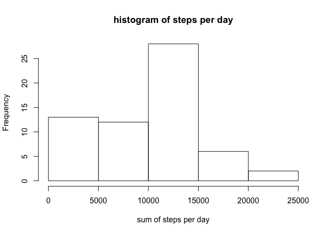
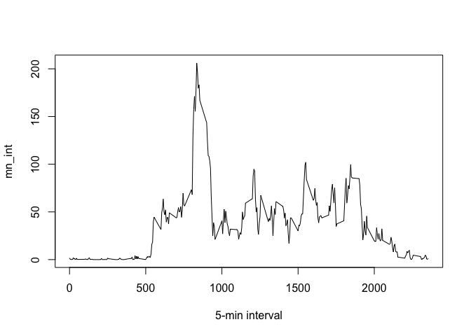
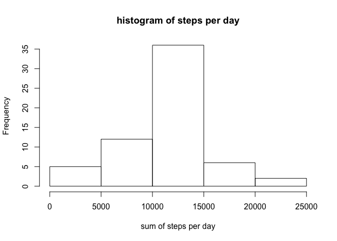

# Reproducible Research: Peer Assessment 1


## Loading and preprocessing the data

```r
#1. Load the data (i.e. read.csv())
setwd("~/Documents/git/RepData_PeerAssessment1")
if (!file.exists("./activity.csv")) {
    download.file("https://d396qusza40orc.cloudfront.net/repdata%2Fdata%2Factivity.zip", "./activity.zip")
    unzip("./activity.zip", overwrite = T, exdir = ".")
}
activity <- read.csv("./activity.csv", header = T, sep = ",")
#2. Process/transform the data (if necessary) into a format suitable for your analysis
activity$date <- as.Date(activity$date)
```

## What is mean total number of steps taken per day?

```r
#1. Calculate the total number of steps taken per day
su <- tapply(activity$steps, activity$date, sum, na.rm=T)
su
```

```
## 2012-10-01 2012-10-02 2012-10-03 2012-10-04 2012-10-05 2012-10-06 
##          0        126      11352      12116      13294      15420 
## 2012-10-07 2012-10-08 2012-10-09 2012-10-10 2012-10-11 2012-10-12 
##      11015          0      12811       9900      10304      17382 
## 2012-10-13 2012-10-14 2012-10-15 2012-10-16 2012-10-17 2012-10-18 
##      12426      15098      10139      15084      13452      10056 
## 2012-10-19 2012-10-20 2012-10-21 2012-10-22 2012-10-23 2012-10-24 
##      11829      10395       8821      13460       8918       8355 
## 2012-10-25 2012-10-26 2012-10-27 2012-10-28 2012-10-29 2012-10-30 
##       2492       6778      10119      11458       5018       9819 
## 2012-10-31 2012-11-01 2012-11-02 2012-11-03 2012-11-04 2012-11-05 
##      15414          0      10600      10571          0      10439 
## 2012-11-06 2012-11-07 2012-11-08 2012-11-09 2012-11-10 2012-11-11 
##       8334      12883       3219          0          0      12608 
## 2012-11-12 2012-11-13 2012-11-14 2012-11-15 2012-11-16 2012-11-17 
##      10765       7336          0         41       5441      14339 
## 2012-11-18 2012-11-19 2012-11-20 2012-11-21 2012-11-22 2012-11-23 
##      15110       8841       4472      12787      20427      21194 
## 2012-11-24 2012-11-25 2012-11-26 2012-11-27 2012-11-28 2012-11-29 
##      14478      11834      11162      13646      10183       7047 
## 2012-11-30 
##          0
```

```r
#2. If you do not understand the difference between a histogram and a barplot, research the difference between them. Make a histogram of the total number of steps taken each day
hist(su, xlab = "sum of steps per day", main = "histogram of steps per day")
```

 

```r
#3. Calculate and report the mean and median of the total number of steps taken per day
mean_su <- round(mean(su))
median_su <- round(median(su))
print(c("The mean is",mean_su))
```

```
## [1] "The mean is" "9354"
```

```r
print(c("The median is",median_su))
```

```
## [1] "The median is" "10395"
```


## What is the average daily activity pattern?

```r
#1. Make a time series plot (i.e. type = "l") of the 5-minute interval (x-axis) and the average number of steps taken, averaged across all days (y-axis)
mn_int <- tapply(activity$steps, 
                 activity$interval, 
                 mean, 
                 na.rm=T)
plot(mn_int ~ unique(activity$interval), 
     type="l", 
     xlab = "5-min interval")
```

 

```r
#2. Which 5-minute interval, on average across all the days in the dataset, contains the maximum number of steps?
mn_int[which.max(mn_int)]
```

```
##      835 
## 206.1698
```

## Imputing missing values

```r
#1. Calculate and report the total number of missing values in the dataset (i.e. the total number of rows with NAs)
sum(is.na(activity) == TRUE)
```

```
## [1] 2304
```

```r
#2. Devise a strategy for filling in all of the missing values in the dataset. The strategy does not need to be sophisticated. For example, you could use the mean/median for that day, or the mean for that 5-minute interval, etc.

#3. Create a new dataset that is equal to the original dataset but with the missing data filled in.
activity2 <- activity  # creation of the dataset that will have no more NAs
for (i in 1:nrow(activity)){
    if(is.na(activity$steps[i])){
        activity2$steps[i]<- mn_int[[as.character(activity[i, "interval"])]]
    }
}
#4. Make a histogram of the total number of steps taken each day and Calculate and report the mean and median total number of steps taken per day. Do these values differ from the estimates from the first part of the assignment? What is the impact of imputing missing data on the estimates of the total daily number of steps?
su2 <- tapply(activity2$steps, 
              activity2$date, 
              sum, 
              na.rm=T)
hist(su2, 
     xlab = "sum of steps per day", 
     main = "histogram of steps per day")
```

 

```r
mean_su2 <- round(mean(su2))
median_su2 <- round(median(su2))
print(c("The mean is",mean_su2))
```

```
## [1] "The mean is" "10766"
```

```r
print(c("The median is",median_su2))
```

```
## [1] "The median is" "10766"
```

```r
df_summary <- rbind(data.frame(mean = c(mean_su, mean_su2), 
                               median = c(median_su, median_su2)))
rownames(df_summary) <- c("with NA's", "without NA's")
print(df_summary)
```

```
##               mean median
## with NA's     9354  10395
## without NA's 10766  10766
```


## Are there differences in activity patterns between weekdays and weekends?

```r
#1. Create a new factor variable in the dataset with two levels – “weekday” and “weekend” indicating whether a given date is a weekday or weekend day.
activity2$weekday <- c("weekday")
activity2[weekdays(as.Date(activity2[, 2])) %in% 
              c("Saturday", "Sunday", "samedi", "dimanche", "saturday",
                "sunday", "Samedi", "Dimanche"), ][4] <- c("weekend")
activity2$weekday <- factor(activity2$weekday)


#2. Make a panel plot containing a time series plot (i.e. type = "l") of the 5-minute interval (x-axis) and the average number of steps taken, averaged across all weekday days or weekend days (y-axis). See the README file in the GitHub repository to see an example of what this plot should look like using simulated data.
activity2_weekend <- subset(activity2, 
                            activity2$weekday == "weekend")
activity2_weekday <- subset(activity2, 
                            activity2$weekday == "weekday")

mean_activity2_weekday <- tapply(activity2_weekday$steps,
                                 activity2_weekday$interval, 
                                 mean)
mean_activity2_weekend <- tapply(activity2_weekend$steps,
                                 activity2_weekend$interval, 
                                 mean)
library(lattice)
df_weekday <- NULL
df_weekend <- NULL
df_final <- NULL
df_weekday <- data.frame(interval = unique(activity2_weekday$interval), 
                         avg = as.numeric(mean_activity2_weekday), 
                         day = rep("weekday", length(mean_activity2_weekday)))
df_weekend <- data.frame(interval = unique(activity2_weekend$interval), 
                         avg = as.numeric(mean_activity2_weekend), 
                         day = rep("weekend", 
                                   length(mean_activity2_weekend)))
df_final <- rbind(df_weekday, df_weekend)
xyplot(avg ~ interval | day, 
       data = df_final, 
       layout = c(1, 2), 
       type = "l", 
       ylab = "Number of steps")
```

 
